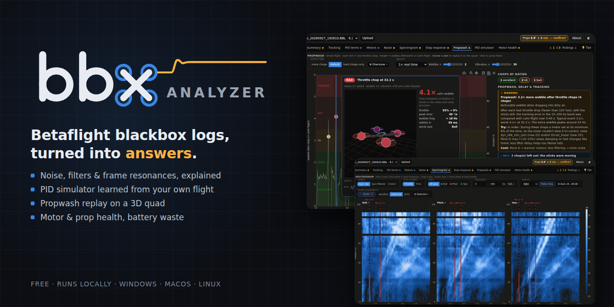
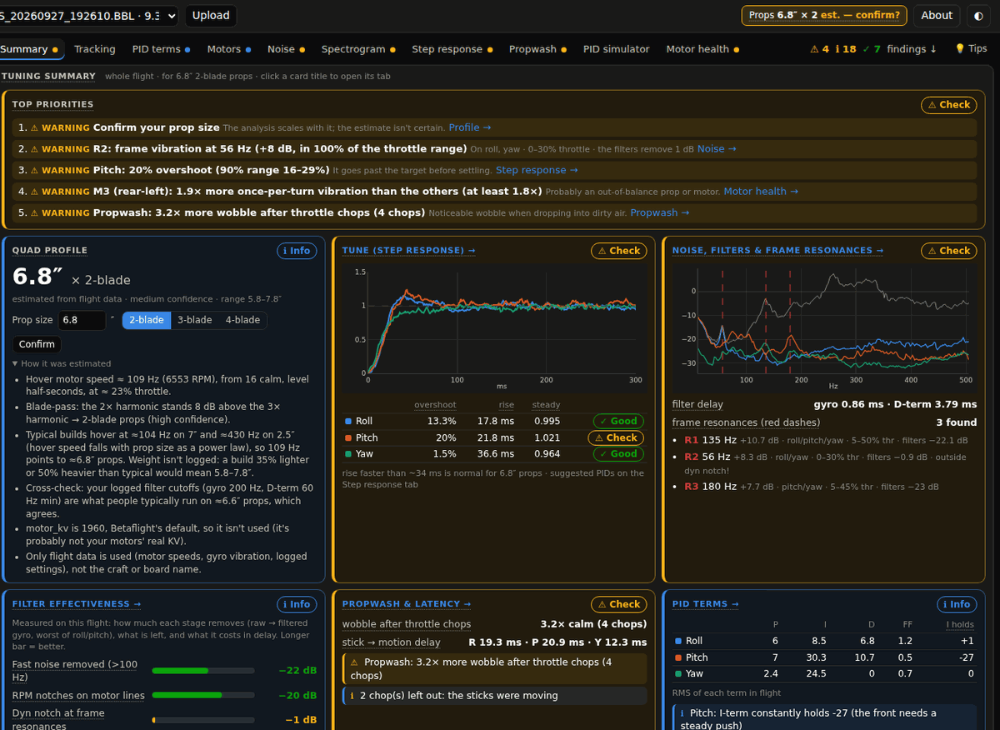
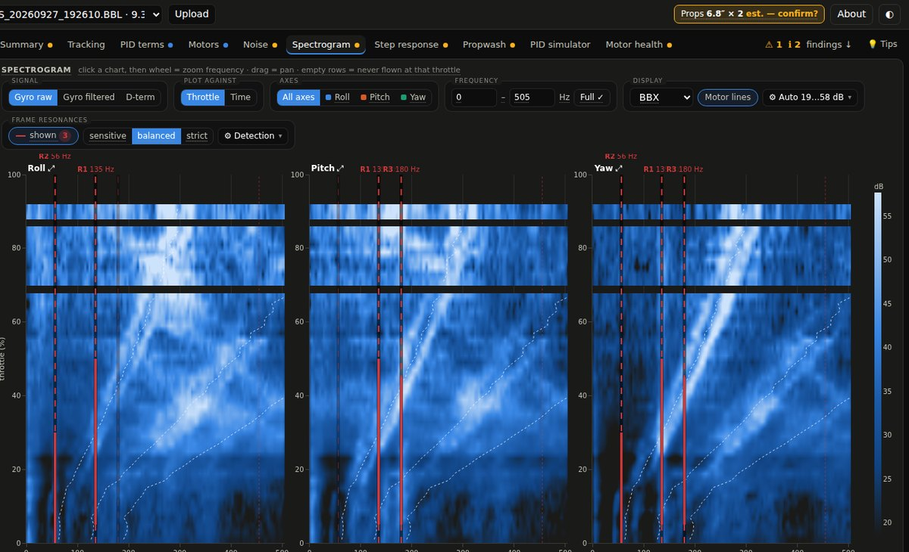
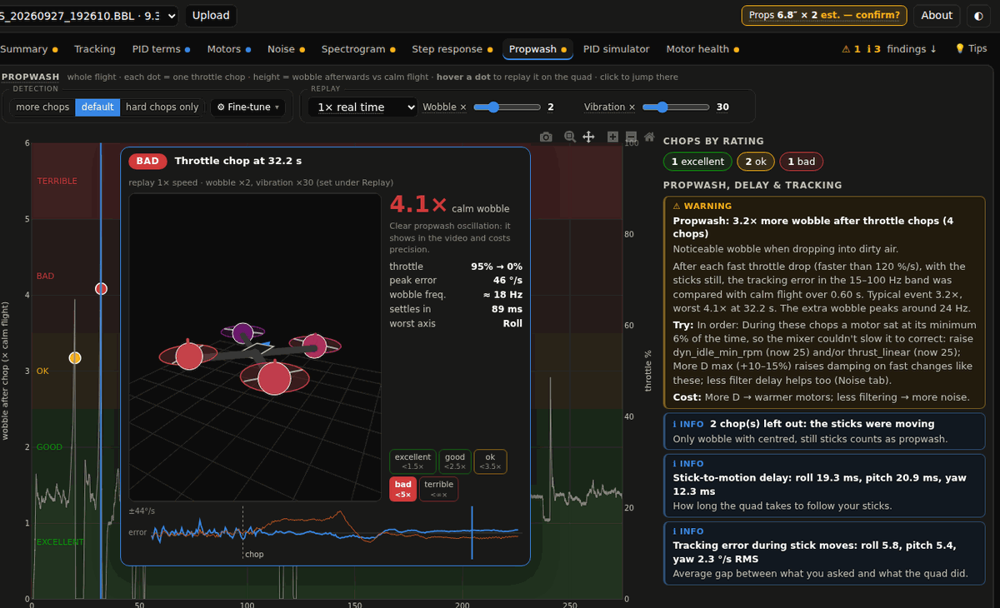
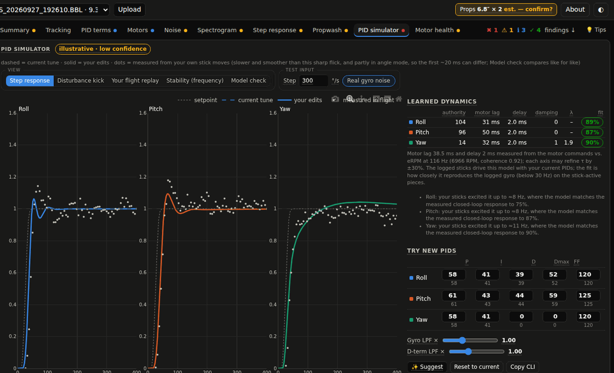
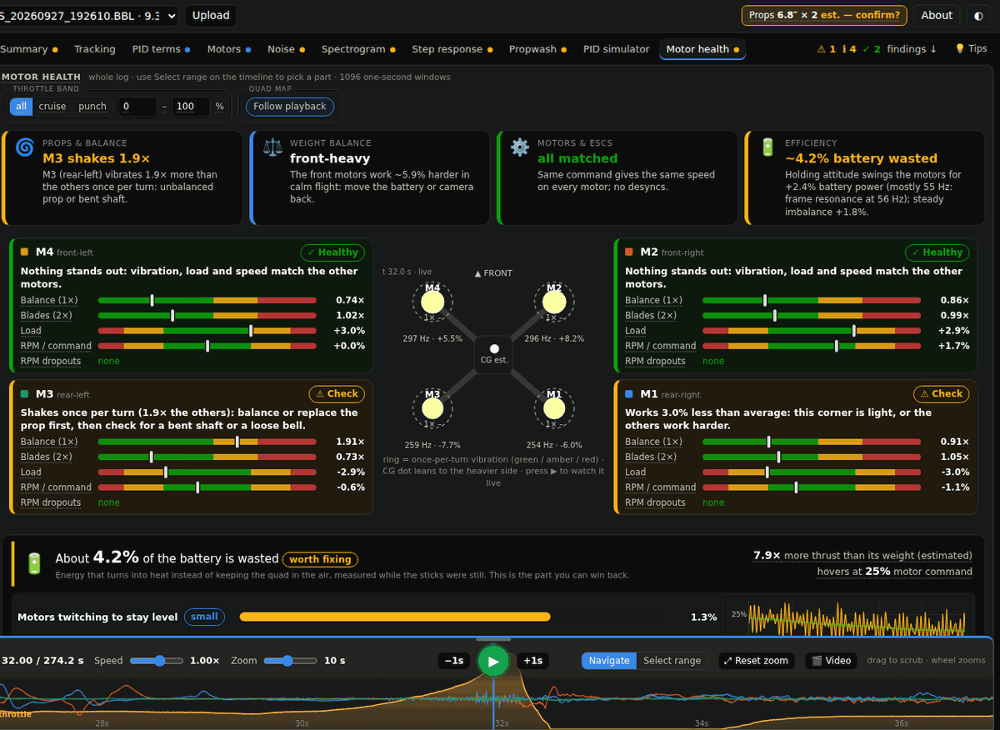
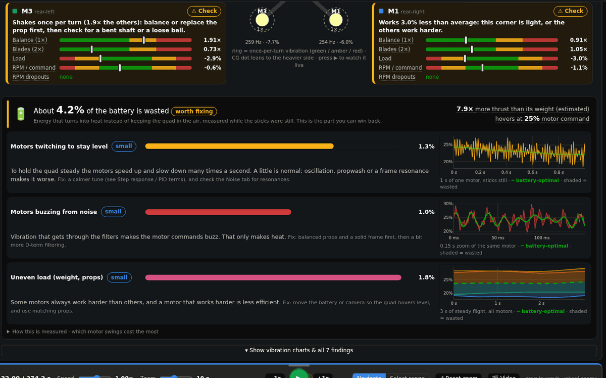
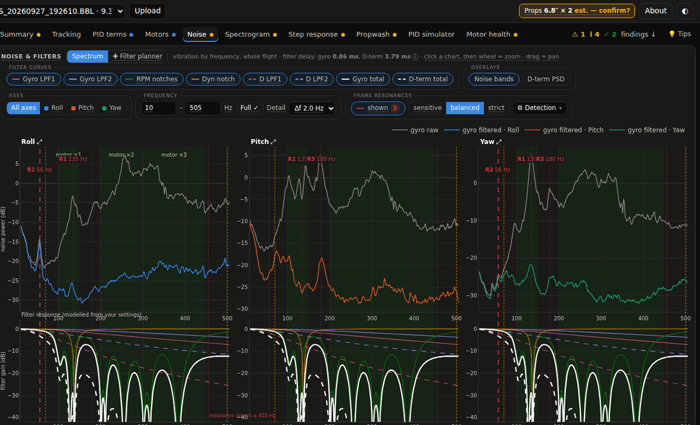
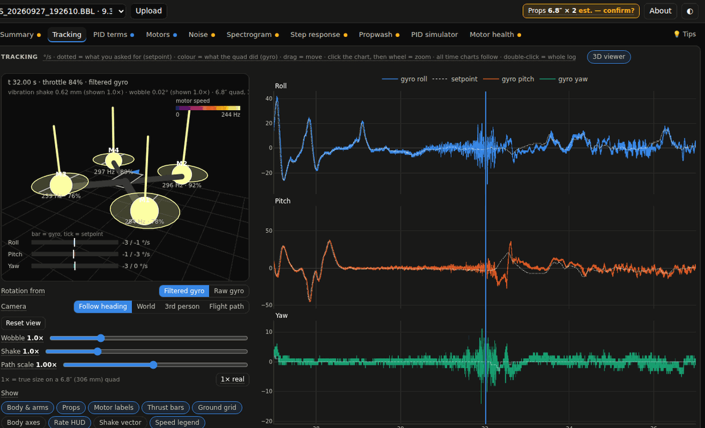

**BBX Analyzer** reads your Betaflight blackbox logs and tells you, in plain words, what is going on with your quad and what to try next. It covers noise and filters, frame resonances, the tune, propwash, and motor and prop health. Every finding comes from your own log, and each fix comes with the CLI lines.

It runs on your computer, in your browser. Your logs never leave your machine.

---

## Get started (about 2 minutes)

1. **Download** the zip from [Releases](../../releases), or use **Code → Download ZIP** on this page.
2. **Unzip** it somewhere normal, such as Documents. Don't run it from inside the zip.
3. **Start it** for your system:

| | Do this | The first time only |
|---|---|---|
| **Windows** | Double-click **`start.bat`** | If a blue *"Windows protected your PC"* box appears, click **More info → Run anyway** (or **Run** if it asks *"Do you want to run this file?"*). |
| **macOS** | Double-click **`start.command`** | If macOS says it *"cannot be opened"*, right-click it → **Open** → **Open**. On newer macOS: **System Settings → Privacy & Security → Open Anyway**. |
| **Linux** | Run **`bash start.sh`** in a terminal from the folder | Afterwards it's in your applications menu as *BBX Analyzer*. |

Your browser opens BBX Analyzer by itself. **Drop a `.BBL` file** onto the page, or pick one from the list.

**You don't need to install anything first.** The first start sets everything up inside the folder and takes 1–3 minutes. It needs internet once. It uses the Python you already have (3.10–3.13); if there is none, it downloads a private copy just for BBX. Later starts take a few seconds.

After the first start you also get a **BBX Analyzer** shortcut with its icon: on the Desktop (Windows), as an app in the folder (macOS) or in the applications menu (Linux). To stop BBX, close its terminal window.

---

## What it finds that the classic tools don't

If you know Blackbox Explorer or PIDtoolbox, you already have traces, spectra, spectrograms and step responses. BBX has those too, and adds the parts that answer *"so what do I change?"*:

- 🧠 **A PID simulator learned from your own flight.** BBX fits your quad's real dynamics from the log: motor lag from eRPM, control authority and damping. It then runs Betaflight's PID loop and your actual filters against them. Change P, I, D, D max or FF and you see the step response, how it handles a sudden kick, and stability margins. You can also replay your real stick inputs through the new tune.
- 🌊 **Propwash, chop by chop.** Every throttle chop is found and scored only while the sticks are still, then rated from *excellent* to *terrible*. Hover a chop and a 3D quad replays it, wobble included.
- 🔊 **Frame resonances and a filter planner.** BBX finds frame resonances that stay at one frequency while the motor noise moves with RPM. It tells you whether your filters actually remove them and proposes notches with ready-to-paste CLI. It also predicts what a change does to noise and delay before you fly it.
- ⚙️ **Motor & prop health per motor.** It tracks each motor's own rotation, so it can say *"M3 vibrates 1.9× more than the others once per turn: unbalanced prop or bent shaft"*. It also covers load balance (which side is heavy), speed for the same command, and desync detection.
- 🔋 **Where your battery goes.** It estimates how much power is lost to motors twitching, buzzing on noise and uneven load. Each effect is shown on your own motor traces. No current sensor needed.
- 📋 **Plain-language findings.** Each one has a *Try:* and a *Cost:*, with the CLI lines to paste. Prop size and blade count are estimated from the log, so the advice fits a 2.5″ whoop and a 10″ long-range rig alike.
- 🎬 **3D replay and synced video.** Play the flight on an animated quad, or load your DVR clip and watch it behind the charts.

---

## A look inside

| | |
|---|---|
|  |  |
| **Summary**: top priorities first, every analysis on one page | **Spectrogram**: frame resonances marked, motor harmonics overlaid |
|  |  |
| **Propwash**: hover a chop to replay it, with its rating and stats | **PID simulator**: your quad's dynamics, your filters, new PIDs |
|  |  |
| **Motor health**: one card per motor, where it sits on the frame | **Battery**: the real motor trace vs the battery-optimal line |
|  |  |
| **Noise & filters**: raw vs filtered, filter shapes, the planner | **Tracking**: sticks vs gyro with the 3D quad |

---

## Good to know

- **Which logs?** Betaflight `.BBL` / `.BFL` files. For the motor analyses, turn on **bidirectional DShot** (eRPM in the log). Logging at 1–2 kHz is ideal.
- **Where are my logs kept?** In the `logs` folder inside BBX. Decoded logs are cached there, so they open instantly the second time.
- **Does it need the internet?** Only for the first setup. After that it works offline.
- **Suggestions are a starting point.** BBX explains *why* it suggests something, but every quad is different. Change one thing at a time, hover-test first and check motor temperature.

<b>Troubleshooting</b>

- **Windows: nothing happens / a window flashes and closes.** Unzip first (right-click the zip → *Extract All…*), then run `start.bat` from the extracted folder.
- **"Could not set up Python automatically".** Install Python 3.12 from [python.org](https://www.python.org/downloads/) (on Windows tick *"Add python.exe to PATH"*), then start again.
- **macOS: "cannot be opened because it is from an unidentified developer".** See the macOS row above. You can also open *Terminal*, type `bash ` (with a space), drag `start.command` into the window and press Enter.
- **The browser didn't open.** Copy the address shown in the terminal window (for example `http://127.0.0.1:8000`) into your browser.
- **Start over clean.** Delete the hidden `.venv` and `.tools` folders inside BBX and start again.
- **Still stuck?** Open an issue and paste what the terminal window shows.

<b>For developers</b>

Python (FastAPI + numpy) backend and a vanilla JS + Plotly frontend, no build step. Run it by hand with
`pip install -r requirements.txt` + the orangebox wheel (see `start.sh`), then `uvicorn app:app`.
How the analyses work, and the reasoning behind them, is in **[docs/TECHNICAL.md](docs/TECHNICAL.md)**.

---

## Licence & credits

BBX Analyzer © 2026 **Martin Dimitrievski**. Free to use, modify and share for **non-commercial** purposes (see [LICENSE](LICENSE)). Commercial use needs written permission.

Built on [orangebox](https://github.com/atomgomba/orangebox) (blackbox decoding), [Plotly.js](https://plotly.com/javascript/), [FastAPI](https://fastapi.tiangolo.com/) and [NumPy](https://numpy.org/).
Thanks to the Betaflight developers and the FPV community, who document filters, PIDs and blackbox fields so the rest of us can understand our quads.
